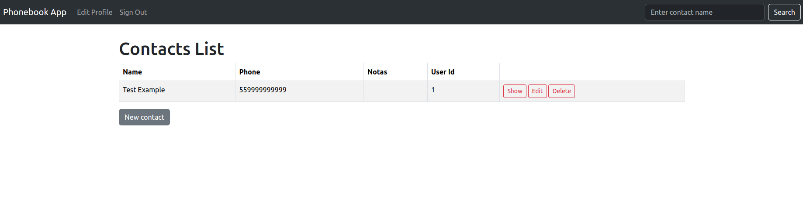
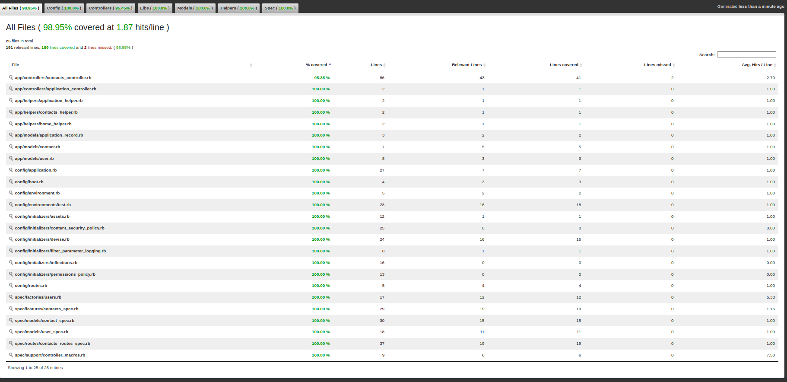

# Phonebook Application



You can access the application [here](https://phonebook-app-2xtx.onrender.com/)

## Description

This is a phonebook application that allows users to access, retrieve passwords, add a contact, remove a contact, search by name, add notes, and edit a contact. The application consists of a frontend using HTML, CSS, and JavaScript, and a backend using Ruby on Rails.

## Installation

### Prerequisites

- Ruby 3.0.2
- Rails 7.1.3.4
- PostgreSQL
- Bundler
- Yarn

### Steps

1. Clone the repository:

```sh
git clone https://github.com/ninapferrari/phonebook_app.git
cd phonebook_app
```

2. Install the dependencies:

```sh
bundle install
```

3. Configure the database:

```sh
rails db:create
rails db:migrate
```

4. Start the Rails server:

```sh
rails server
```

5. Access the application in your browser:

```
http://localhost:3000
```

## Usage

### Frontend

- Sign up or Sign in for using the features.  
- Use the form on the main page to add new contacts.
- View, edit, or remove contacts in the list of recent additions.
- Use the search bar to filter contacts by name.
- Add notes to contacts as needed.

### Backend

- Use the API endpoints to programmatically manage contacts.

## Features

- **Add Contact**: Add new contacts with name, phone number, and notes.
- **Remove Contact**: Remove existing contacts.
- **Edit Contact**: Edit information of existing contacts.
- **Filter Contacts**: Filter contacts by name.
- **Authentication**: Users can create accounts and log in to manage their contacts.

## Technologies Used

- **Frontend**: HTML, CSS, Bootstrap, JavaScript
- **Backend**: Ruby on Rails
- **Database**: PostgreSQL
- **Gems**:
  - `devise` for authentication
  - `pg` for PostgreSQL
  - `puma` for the web server
  - `rspec-rails` for testing
  - `capybara` for integration testing
  - `simplecov` for test coverage


## Running Tests

To run the tests for this application,

 you can use the following commands:

1. Run the RSpec tests:

```sh
rspec
```

2. Check the test coverage report:

The test coverage report is generated using SimpleCov. After running the tests, you can find the coverage report in the `coverage` directory. Open the `index.html` file in your browser to view the detailed coverage report.

```sh
open coverage/index.html
```

